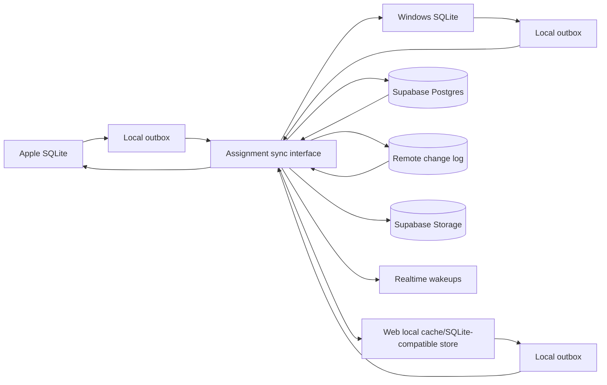
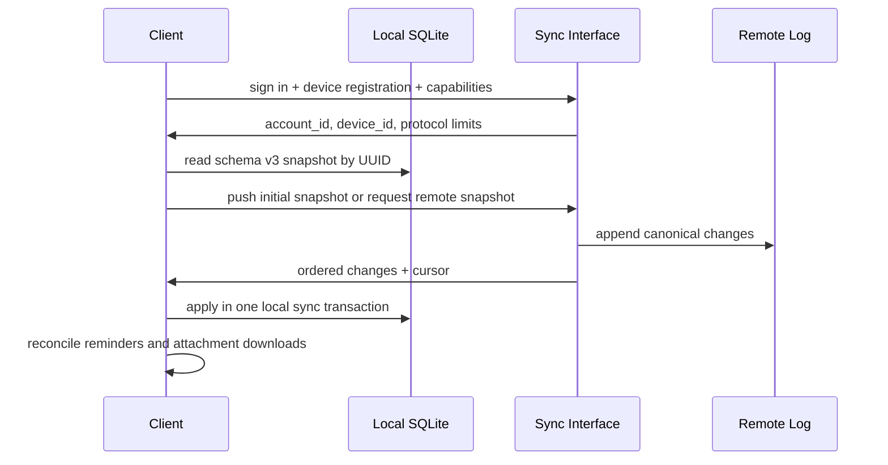

# Phase 6 Multi-Device Sync Architecture

Date: 2026-08-31

Status: Proposed

Author: Codex architecture agent

## Executive Summary

Assignment App 2.0 should add multi-device sync as a local-first protocol over
the existing SQLite schema v3 data model, not as a replacement for local
storage. The recommended Phase 6 architecture is a custom sync protocol hosted
on Supabase-managed Postgres, Supabase Auth, and Supabase Storage, with Apple,
Windows, and Web clients keeping SQLite as the source of offline interaction.

Supabase is recommended because it gives the project cross-platform identity,
Postgres durability, row-level authorization, realtime wakeups, object storage,
and a manageable hosted operations model while still leaving the app in control
of deterministic merge rules. CloudKit is rejected as the primary sync backend
because it creates a strong Apple-first user-account dependency and leaves
Windows as a second-class path. A fully self-hosted FastAPI, PostgreSQL, and
object-storage stack remains the long-term escape hatch, but it is too much
operational surface for the first multi-device release.

This ADR is an architecture decision only. It does not implement sync, create a
cloud project, modify production code, migrate user data, register accounts,
write secrets, deploy servers, push branches, or claim any sync behavior is
already available.

## Current Project Context

Repository inspection on 2026-08-31 found:

- Repository path: `D:\Desktop\assignment-app-sync-adr`
- Branch: `qianmuyan001/sync-adr`
- HEAD: `079d779e11c2923cd2b03e1a7ea8b5d08ca622a1`
- Upstream comparison: `origin/main...HEAD` was `0 0` before this ADR edit.
- Worktree isolation: created from `D:\Desktop\assignment-app` with `git worktree`.
- Source version: `2.0.0`
- Tags: only `v1.0.0`
- Existing phase reports in this checkout: `phase-0.md` and `phase-1.md`; no
  `docs/phase-reports/phase-2.md` exists in this checked-out repository.

The app currently has a FastAPI backend, static Web client, SwiftUI iPadOS/Mac
Catalyst client, WinUI 3 Windows client, and SQLite local storage. Schema v3 is
the current data contract. It includes:

- `database_identity`
- `assignments`
- `courses`
- `projects`
- `tags`
- `task_tags`
- `subtasks`
- `attachments`
- `reminders`

Phase 6 must not depend on unfinished Phase 2.5 or Phase 3A code. Future
entities such as timetable entries, exams, grades, and focus records should fit
the protocol, but this ADR treats schema v3 as the implementation fact.

## Goals and Non-Goals

Goals:

- Preserve SQLite local-first behavior and offline task management.
- Add account-based multi-device sync without using local integer IDs as remote
  identity.
- Define deterministic conflict rules for every schema v3 entity class.
- Support attachments, reminders, local wall-time deadlines, tombstones, schema
  evolution, security, observability, and failure recovery.
- Choose one recommended architecture and define adoption and exit conditions.

Non-goals:

- No sync implementation in this phase.
- No schema v4 migration or Phase 3A entity implementation.
- No production-code changes.
- No cloud account, deployment, secret, release, tag, push, or merge.
- No promise that realtime delivery is required for correctness; polling and
  catch-up must remain sufficient.

## Data Semantics That Must Not Break

- `assignments.id` and every other SQLite integer `id` are local database
  identities only. They must never cross the sync interface as stable identity.
- Entity UUIDs are the cross-device identities. Existing migrated task and
  course UUIDs may be UUID v5; new records are UUID v4.
- `database_identity.instance_uuid` is database lineage, not a user account,
  device account, tenant, or sync namespace.
- A copied SQLite database retains its `instance_uuid`; an independently
  created database receives a different one.
- `deleted_at IS NULL` means active. Ordinary deletion is soft deletion.
- Task status is stored in SQLite as `not_started`, `in_progress`, or
  `completed`; UI/API status remains `todo`, `in_progress`, or `done`.
- Parent task progress from subtasks is derived. Sync must not allow one device
  to overwrite derived progress with a stale scalar value.
- `due_date` is local wall time text, not a UTC instant. `timezone_id` is an
  IANA time zone when available and may be `NULL` for migrated history.
- UTC audit timestamps are for ordering, idempotency, conflict windows, and
  observability; they do not reinterpret local deadlines.
- Reminder rows store reminder intent only. Platform notification identifiers
  remain device-local runtime state.
- Attachment database rows store metadata only. Payloads live under immutable
  UUID object keys such as `attachments/<attachment UUID>`.
- SQLite migration safety remains separate from sync: Online Backup,
  `BEGIN IMMEDIATE`, integrity validation, and fail-closed recovery stay owned
  by platform migration runners.

## Decision Drivers and Priority

1. Correctness of local-first data semantics.
2. Cross-platform reach across Apple, Windows, and Web.
3. Deterministic conflict resolution that can be tested without a cloud service.
4. Account, device, export, and deletion behavior that users can understand.
5. Attachment support without storing binary payloads in SQLite or Postgres.
6. Security and privacy that match the app's existing credential-store model.
7. Low enough operations burden for a student-facing app.
8. Avoiding irreversible vendor lock-in.
9. A staged path that does not block Phase 3A/schema v4.

## Candidate Comparison

Official-source claims in this section were checked on 2026-08-31.

| Option | Cross-platform fit | Offline fit | Auth | Conflict control | Attachments | Cost and ops | Lock-in | Verdict |
| --- | --- | --- | --- | --- | --- | --- | --- | --- |
| Apple CloudKit | Excellent for Apple; Web possible through CloudKit JS; no native Windows SDK path | Supports cloud change tokens and subscriptions, but app still owns local cache and merge | Tied to Apple Account/iCloud for private data | Record save policies expose conflicts, but domain merge remains app code | `CKAsset` works well in Apple ecosystem | Apple Developer Program includes CloudKit capacity, low backend ops | High Apple ecosystem/account lock-in | Reject as primary backend; keep as future Apple-only adapter possibility |
| Self-hosted FastAPI + PostgreSQL + object storage | Excellent: every client can call HTTP | Fully custom local-first protocol | Custom OAuth/JWT/session/device lifecycle | Maximum control | S3-compatible layout works | Highest ops: provisioning, backups, monitoring, security, incident response | Low if using standard Postgres and S3-compatible layout | Reject for Phase 6 start; keep as exit strategy |
| Supabase-managed Postgres/Auth/Storage | Good for Apple, Windows, and Web over HTTPS; JS and REST paths for Web | Not a local-first engine, but suitable server substrate for a custom protocol | Built-in Auth, JWT, policies, MFA options | App owns merge rules; Postgres enforces invariants | Storage supports RLS and resumable uploads | Free/pro tiers, managed backups on paid plans, moderate ops | Moderate; data is portable Postgres plus object keys, but Auth/Storage conventions couple the app | Recommend |
| Manual export/import baseline | Universal file compatibility | Fully offline | None required | Manual, user-confirmed | Manifest plus files/archive | Lowest cost and ops | Lowest | Keep as baseline and fallback, not real sync |

Current cost and license snapshot:

- Apple Developer Program membership is the CloudKit entry cost for app
  distribution; Apple's program page described included CloudKit capacity on
  2026-08-31. This is operationally cheap but ecosystem-specific.
- Supabase pricing on 2026-08-31 listed Free at `$0/month` with 50,000 MAU,
  500 MB database size, 1 GB file storage, 5 GB egress, two active projects, and
  inactivity pause; Pro started at `$25/month` with larger included database,
  file storage, egress, and backups. These numbers must be rechecked before
  Phase 6.0 starts.
- FastAPI and PostgreSQL are permissive open-source building blocks; a
  self-hosted object store can use S3-compatible services, but each provider's
  storage, request, transfer, backup, and operations costs must be priced before
  launch.
- Supabase's source repository is open source, and managed Supabase lowers
  operations work, but the hosted platform's Auth, Storage, Realtime, backup,
  and dashboard behavior are still provider-specific.

## Decision

Use Supabase-managed Postgres, Supabase Auth, Supabase Storage, and an
Assignment App sync protocol as the recommended Phase 6 architecture.

The sync protocol is an app-owned module with a small interface:

- `pullChanges(cursor, capabilitySet) -> ordered changes, nextCursor`
- `pushBatch(deviceId, idempotencyKey, baseCursor, operations) -> accepted,
  conflicts, nextCursor`
- `claimAttachmentUpload(attachmentUuid, sha256, byteSize) -> upload target`
- `commitAttachmentUpload(attachmentUuid, sha256, byteSize) -> metadata state`
- `listDevices()`, `revokeDevice(deviceId)`, `exportAccount()`,
  `requestAccountDeletion()`

Supabase is the first adapter behind that interface. A later self-hosted adapter
must be possible without changing the client-side SQLite/outbox merge model.

Adoption conditions:

- Supabase pricing, quotas, Auth, Storage, Realtime, and export behavior remain
  acceptable at the start of Phase 6.0.
- The team can model schema v3 entities in Postgres without weakening local
  SQLite invariants.
- A two-device offline conflict test suite passes against a disposable hosted
  or local Supabase environment.
- Service-role keys never ship in Apple, Windows, or Web clients.

Abandon conditions:

- Required sync behavior cannot be expressed without bypassing row-level
  authorization from clients.
- Supabase Storage object access cannot be constrained to account-owned
  attachment keys with acceptable signed URL lifetimes.
- Pricing or inactive-project behavior makes the hosted plan unsuitable before
  public release.
- Product requirements demand a non-Supabase identity provider or infrastructure
  control that would make self-hosted FastAPI/PostgreSQL cheaper to maintain.

## Rejected Options

CloudKit as primary sync is rejected because Windows support would need
CloudKit JS/Web Services rather than a first-class native client SDK. It also
couples user identity to Apple Account/iCloud, which is surprising for a Windows
and Web task manager. CloudKit remains attractive for an Apple-only app or a
future optional Apple adapter because it offers native subscriptions, change
tokens, save policies, private/shared databases, encrypted fields, and assets.

Self-hosted FastAPI/PostgreSQL/object storage is rejected for the first release
because it makes Assignment App responsible for every production concern:
identity lifecycle, email, MFA, session revocation, rate limiting, database
backups, object-store security, monitoring, uptime, incident response, and
capacity planning. It remains the preferred exit architecture because it uses
plain HTTP, Postgres, and S3-compatible object keys.

Manual export/import is rejected as multi-device sync because it cannot provide
continuous convergence, device revocation, tombstone propagation, retry
semantics, or automatic conflict resolution. It remains mandatory as a fallback
for export, support, account deletion, and vendor-exit confidence.

## System Components

Text view:

1. Each Apple, Windows, and Web client writes user actions to local SQLite in a
   transaction.
2. The same transaction records a local outbox operation using UUID identities.
3. A sync runner pushes idempotent outbox batches to the remote sync interface.
4. The remote sync module validates account/device authorization, writes a
   canonical change log, stores current materialized state, and returns conflicts.
5. Clients pull ordered changes by cursor and apply them through the local
   repository layer so local invariants remain enforced.
6. Attachment payloads use a two-phase metadata/file flow through Storage.
7. Realtime notifications are wakeups only; correctness comes from pull cursors.

## First Sync Flow

Readable sequence:

1. User signs in or creates an account.
2. Client creates or reuses a local device identity stored in Keychain or
   Windows Credential Locker. Web uses the browser's secure storage model and
   must tolerate loss of local device state.
3. Client sends `database_identity.instance_uuid`, app version, schema version,
   sync protocol version, and capability set.
4. Server creates or joins an account sync space.
5. If the account has no remote data, the client uploads a full snapshot as a
   sequence of create operations plus attachment metadata placeholders.
6. If the account already has data, the client pulls the remote snapshot, maps
   rows by UUID, and runs import conflict checks before applying locally.
7. Client records the returned remote cursor only after local apply succeeds.
8. Reminder reconciliation runs after local apply; platform notification IDs are
   regenerated locally.

## Daily Incremental Sync

Push and pull order:

1. Local user actions write SQLite and outbox entries in the same transaction.
2. Sync runner starts only when no local migration is in progress.
3. Push pending outbox batches first, oldest first, with stable idempotency keys.
4. Server validates each operation against the caller account, device, base
   entity version, deleted state, and protocol version.
5. Server appends accepted changes to the remote change log and returns conflicts
   that need local merge or user confirmation.
6. Client marks accepted outbox entries only after the server response is durably
   stored locally.
7. Client pulls from the last durable cursor.
8. Client applies remote changes through repository-level validation in one
   transaction per bounded page.
9. Cursor advances only after the page has been applied and validation passes.
10. Realtime messages only trigger this loop; missed messages are harmless.

Idempotency:

- Every outbox operation has `operation_uuid`, `device_uuid`, `entity_uuid`,
  `entity_type`, `operation_kind`, `base_remote_version`, payload, UTC
  `created_at`, and retry metadata.
- `pushBatch` has an idempotency key independent of HTTP retries.
- The server stores `(account_id, device_uuid, operation_uuid)` and returns the
  same result for duplicate requests.
- Attachment upload commit uses `(account_id, attachment_uuid, sha256, byte_size)`
  as the idempotency tuple.

Retry and recovery:

- Retry transient failures with exponential backoff and jitter.
- Pause on authentication failure, revoked device, unsupported protocol, local
  migration failure, or repeated integrity validation failure.
- On app restart, resume from durable outbox entries and the last durable cursor.
- After long offline periods, pull pages until the cursor catches up. If the
  server no longer has needed tombstones or change-log history, run a bounded
  full reconciliation by UUID before allowing push.

## Remote Data Model

Remote tables should use UUIDs, not SQLite integer IDs. A minimum model:

- `accounts`: user-owned sync space.
- `account_members`: auth user to account relation, initially one user.
- `devices`: account device UUID, display name, platform, public metadata,
  created/revoked timestamps.
- `entity_state`: current materialized state by `(account_id, entity_type,
  entity_uuid)` with remote version, deletion state, and JSON payload.
- `change_log`: append-only ordered changes with remote sequence/cursor,
  operation UUID, device UUID, entity UUID, changed fields, and redacted audit.
- `attachment_objects`: attachment UUID, object key, sha256, byte size, upload
  state, owner account, and garbage-collection state.
- `sync_protocol_versions`: server-supported protocol ranges and feature flags.

Postgres foreign keys may reference remote UUIDs or internal surrogate keys, but
surrogate keys must never leak into the client protocol.

## Identity and Account Behavior

Definitions:

| Concept | Meaning | Cross-device? | Storage |
| --- | --- | --- | --- |
| User account | Human login and billing/export/deletion owner | Yes | Supabase Auth plus app `accounts` table |
| Device identity | One installed client or browser profile registered to an account | Yes, per installation | Keychain/Credential Locker/browser storage plus remote `devices` |
| Database lineage | Origin of a local SQLite database copy | Yes as metadata, not ownership | `database_identity.instance_uuid` |
| Local integer ID | SQLite row key used by one database | No | Local SQLite only |
| Entity UUID | Stable identity for task, course, tag, relationship, attachment, reminder | Yes | Local SQLite and remote sync |

Login:

- Signing in links the local database to an account only after first-sync checks.
- The user must confirm whether to merge local data into an existing account,
  replace local data with remote data, or keep a separate local-only database.
- `database_identity.instance_uuid` is sent as lineage metadata to detect copied
  databases and support diagnostics; it is not used as an account key.

Logout:

- Logout revokes local sessions and stops sync.
- The app must offer separate choices for keeping local data, removing local
  account tokens, and deleting local synced data.
- Logging out never implies deleting assignments.

New device:

- The device registers with a fresh `device_uuid`.
- It performs initial pull before push unless the local database already has
  unsynced data, in which case the user chooses merge or keep local-only.

Copied database:

- Two devices may present the same `instance_uuid` if a SQLite file was copied.
  The server treats that as shared lineage, not the same device.
- Copied databases still need separate `device_uuid` values.

Account deletion:

- User requests deletion from an authenticated device.
- Server marks account deletion pending, blocks new push except export/delete
  confirmation, and propagates a terminal account-deleted state to active devices.
- After the retention window, server hard-deletes entity state, change log,
  device records, and attachment objects according to the deletion policy.

## Conflict Resolution Matrix

The remote server is the deterministic merge authority for automatic merges. A
client may preview conflicts, but every platform must produce the same final
state for the same ordered input.

| Entity or field | Strategy | User confirmation? | Notes |
| --- | --- | --- | --- |
| `database_identity` | Sync as immutable lineage metadata only | No | Never merge, rewrite, or treat as account/device identity. |
| Assignment `title` | Field-level LWW by remote accepted operation time when both sides changed since common base | No | Keep previous values in change log for undo/audit. |
| Assignment `description` | Field-level LWW; preserve `NULL` versus empty string | No | Large text conflict may be surfaced later as review, but deterministic LWW is acceptable. |
| Assignment `link` and source metadata | Field-level LWW | No | Source provenance is metadata, not derived identity. |
| Assignment `priority` | Field-level LWW | No | Values limited to `low`, `medium`, `high`. |
| Assignment `due_date`, `timezone_id`, `all_day` | Atomic deadline group LWW | Sometimes | If both sides changed the group and the resulting wall time differs, keep deterministic winner and record a conflict notice. Never UTC-convert. |
| Assignment `status` and `completed_at` | State-machine merge | Sometimes | Completed beats stale `in_progress` only if based on a version that saw the same active subtask set; otherwise recompute or ask. |
| Assignment `course_id`, `project_id`, `course_name` snapshot | Relationship-by-UUID merge with referential validation | Sometimes | If target course/project was deleted, detach and flag; update `course_name` snapshot with relationship in one apply transaction. |
| Course fields | Field-level LWW for teacher/semester/color/archive; name LWW with normalized-name warning | Sometimes | New courses remain UUID-distinct even if normalized names collide. |
| Project fields | Field-level LWW; course relationship validated by UUID | Sometimes | Deleted parent course detaches project course reference. |
| Tags | Name conflicts merge by UUID, not by normalized name | Yes if duplicate active normalized names appear | Active tag normalized-name uniqueness must be restored deterministically or by user rename. |
| `task_tags` | OR-set style relationship using relationship UUID and pair uniqueness | No for add/remove; yes for duplicate repair | Add wins over stale remove only when remove did not observe the add. Active duplicate pair collapses to one active relationship. |
| Subtask `title` | Field-level LWW | No | UUID remains stable. |
| Subtask `sort_order` | Ordered-list merge by UUID with deterministic tie-break | No | Sort by requested order, then remote version, then UUID for ties. |
| Subtask status and `completed_at` | Same state-machine rules as task status | Sometimes | Completion must have `completed_at`; non-completion must clear it. |
| Parent `progress_percent` | Derived locally and remotely from active subtasks | No | Never accept stale scalar overwrite when subtasks exist. |
| Attachments metadata | Immutable object key and sha256; editable display metadata LWW | Sometimes | If same attachment UUID has different sha256, reject as corruption unless explicitly repaired. |
| Attachment file payload | Content-address validation by sha256 and byte size | No | Upload/download must pass hash before commit. |
| Reminders | Intent LWW by reminder UUID; platform notification ID ignored | No | `trigger_at_utc`, `lead_minutes`, RRULE, enabled state sync. |
| Soft delete versus edit | Delete wins after grace unless edit is newer and user restores | Sometimes | Offline edits to already-confirmed deleted rows cannot recreate data silently. |
| Future timetable entries | Event identity by UUID; time fields grouped | Sometimes | Recurrences and exceptions need schema v4-specific rules. |
| Future exams | Atomic exam schedule group plus grade/result fields separated | Sometimes | Schedule edits should not overwrite entered result data. |
| Future grades | Append or field-LWW depending on final schema | Yes for numeric conflicts | Grade conflicts are high sensitivity. |
| Future focus records | Append-only session log; no LWW except notes | Rare | Overlapping sessions may coexist and be resolved analytically. |

LWW means last writer wins by server-accepted remote sequence, not by device
clock. Device UTC timestamps are audit facts only; they never decide conflicts
without server ordering.

## Delete, Restore, and Garbage Collection

Tombstones:

- Keep tombstones for at least 180 days and at least one public-release support
  window, whichever is longer.
- Keep account-deletion tombstones and device-revocation records long enough to
  prevent old offline devices from rejoining with stale credentials.
- A change-log compaction job may replace old field changes with a snapshot plus
  tombstones, but must preserve enough information for any supported offline
  client to catch up or be forced into full reconciliation.

Restore:

- Restore clears `deleted_at` only through an explicit restore operation.
- Restore of a child row requires the parent task to be active or restored in
  the same batch.
- Restoring a task does not automatically restore soft-deleted attachments,
  reminders, tags, or subtasks unless the user chooses that bundle.

Delete/edit conflicts:

- Delete wins over edits based on older remote versions.
- Edits based on a version newer than the delete become restore candidates, not
  silent resurrection.
- Clients must show "edited after deletion" as a recoverable conflict when the
  user is online.

Hard delete:

- Hard delete may run only after tombstone retention expires, every active
  device has either acknowledged a cursor past the tombstone or has been revoked,
  and attachment cleanup is complete.
- Account deletion bypasses normal per-entity retention only after the user
  confirms export/deletion and any legally required grace period expires.

Garbage collection:

- Server GC deletes orphan attachment objects whose metadata never committed.
- Client GC deletes local orphan payload files only after local metadata state is
  durable and a server tombstone has been applied.
- GC never follows symlinks, never reuses UUID paths, and never trusts original
  file names as paths.

## Attachment Sync

Metadata:

- Attachment rows sync like other entities by UUID.
- `relative_path` remains exactly `attachments/<attachment UUID>`.
- `file_name` is display metadata only and never part of a storage key.
- `sha256` and `byte_size` are immutable for a committed payload. Changing a
  file creates a new attachment UUID.

Upload:

1. Client inserts or updates local attachment metadata in pending-upload state.
2. Client computes SHA-256 before upload.
3. Client requests an upload target for `(attachment_uuid, sha256, byte_size)`.
4. Client uploads to object key `accounts/<account_uuid>/attachments/<attachment_uuid>`.
5. Large files use resumable upload. Phase 6.0 should cap files at a conservative
   product limit such as 25 MB; Phase 6.2 can raise the limit after resumable
   upload tests.
6. Client calls commit. Server verifies object existence, size, hash if
   available through the storage pipeline, and ownership before publishing the
   attachment metadata change.

Download:

- Client downloads to a temporary sibling under the platform app-data attachment
  root.
- Client verifies byte size and SHA-256.
- Client atomically renames into `attachments/<attachment UUID>`.
- If verification fails, delete the temp file, keep metadata as missing/corrupt,
  and retry later.

Deduplication:

- Server may deduplicate by sha256 within one account, but the protocol keeps
  one metadata row per attachment UUID.
- Cross-account deduplication is out of scope because it complicates privacy,
  deletion, and access control.

Encryption and access:

- Transport is HTTPS.
- Object access uses short-lived signed URLs or authenticated Storage policies.
- Service-role keys stay server-side only.
- Optional client-side encryption can be added later, but Phase 6 must first
  ship correct access control and verified deletion.

Deletion:

- Soft-deleting attachment metadata hides it and schedules payload cleanup.
- Hard deletion removes the object only after tombstone retention and device
  acknowledgement rules are satisfied.
- Orphan uploads with no committed metadata are cleaned by age and upload state.

## Reminder and Time-Zone Rules

Reminder sync:

- Sync `trigger_at_utc`, `lead_minutes`, `repeat_rule`, `is_enabled`, audit
  timestamps, and `deleted_at`.
- Do not sync Apple notification request identifiers, Windows toast IDs,
  scheduler state, permission state, or last local OS error.
- `last_scheduled_at` is local scheduling audit and should not be used as a
  cross-device source of truth unless Phase 6 explicitly redefines it.

Notification reconciliation runs:

- On app startup.
- After first sync on a new device.
- After reminder create/update/delete/restore.
- After task completion, task restore, or task deletion.
- After time-zone changes.
- After notification permission changes.
- After a missed-sync catch-up page containing reminder or task changes.

Date and time:

- Preserve `due_date` exactly as local wall-time text.
- Preserve `timezone_id`; `NULL` keeps the schema v3 compatibility rule of
  interpreting under the current device zone.
- Preserve `all_day` separately from UTC audit times.
- Never silently convert historical deadlines into UTC.
- For conflict resolution, treat `due_date`, `timezone_id`, and `all_day` as an
  atomic deadline group.
- New audit timestamps and server change-log timestamps use UTC.

## Authentication and Security

Authentication:

- Supabase Auth is the initial identity provider.
- Clients store refresh/session material only in Apple Keychain, Windows
  Credential Locker, or browser storage appropriate for the Web client.
- SQLite never stores passwords, cookies, service-role keys, or provider tokens.
- Device registration binds a user account, device UUID, platform, app version,
  and last acknowledged cursor.

Authorization:

- Every remote row is scoped by `account_id`.
- Postgres row-level policies protect account rows, sync state, change logs, and
  storage metadata.
- Storage policies restrict object paths to the authenticated account.
- Server-only maintenance jobs use privileged keys; clients never receive them.

Transport and storage:

- All client/server traffic uses HTTPS.
- Hosted database and object storage must use provider-managed encryption at
  rest.
- Attachment signed URLs have short lifetimes and single-purpose paths.

Abuse and replay protection:

- Rate limit login, device registration, push batches, attachment claims, and
  export/delete endpoints.
- Use idempotency records to make retries safe.
- Reject operation UUID replay from another account or device.
- Reject stale protocol versions that cannot understand required tombstone or
  field semantics.

Privacy:

- Logs must redact titles, descriptions, URLs, original file names, and reminder
  text-like fields by default.
- Observability uses UUIDs, operation IDs, error classes, sizes, latencies, and
  counts.
- Export provides a documented JSON manifest plus attachment files.
- Account deletion removes Auth identity linkage, app rows, logs where possible,
  and storage objects according to retention rules.

Device revocation:

- Revoked devices cannot push or fetch new changes.
- Existing local data remains on the device unless the user chooses local data
  removal or the platform supports a remote wipe policy in a later phase.
- A revoked offline device must not be able to recreate tombstoned data when it
  comes back online.

## Schema and Protocol Evolution

Sync protocol versioning is separate from SQLite `PRAGMA user_version`.

The client sends:

- App version.
- SQLite schema version.
- Sync protocol version.
- Supported entity types.
- Supported field set per entity.
- Supported conflict features.
- Attachment protocol capabilities.

Rules:

- Schema v3 is the Phase 6.0 baseline.
- Schema v4 entities may be added as new entity types or optional fields, not by
  changing v3 semantics in place.
- Server may store fields unknown to older clients, but older clients must echo
  only fields they understand and must not clear unknown fields.
- Push batches include changed-field masks.
- Pull pages can omit unsupported entity types while preserving cursor safety
  only if the server knows the client cannot accidentally overwrite them.
- If a change cannot be safely hidden from an old client, the server rejects
  that client's push and requires app upgrade.
- Rollback to an old client is supported only while its protocol version remains
  in the server support window.
- A server field addition must be nullable or defaulted and must not be required
  by old-client push until the minimum supported protocol advances.

Phase 3A/schema v4 impact:

- Timetable, exam, grade, and focus-record entities need final field-level merge
  matrices before they are enabled remotely.
- If schema v4 changes task reminder semantics, Phase 6 must revise the reminder
  conflict rules before enabling sync for those fields.
- If schema v4 introduces recurring classes/exams, recurrence exceptions need
  explicit identity and tombstone behavior.

## Failure Recovery and Observability

Local failures:

- If SQLite validation fails after applying remote changes, roll back the local
  sync transaction and do not advance the cursor.
- If a local migration is required, pause sync until migration completes through
  the existing fail-closed migration path.
- If outbox and data diverge, stop sync and surface a repair/export path.

Remote failures:

- If push partially fails, accepted operations remain accepted and conflicts are
  returned with stable operation results.
- If the server is unavailable, the app remains fully local and queues outbox.
- If Realtime is unavailable, clients continue periodic pull.
- If a cursor expires, run full reconciliation by UUID before accepting local
  push.

Observability:

- Track sync latency, outbox depth, pull page size, push accept/conflict counts,
  retry counts, attachment verification failures, cursor age, and device count.
- Store redacted operation summaries only.
- Keep per-platform sync diagnostic export for support, excluding secrets and
  raw assignment content unless the user explicitly includes it.

## Automated Testing and Fault Injection

Tests must use disposable local databases and disposable remote projects or
local Supabase containers. Never run sync tests against a user database.

Required coverage:

- First sync from empty remote.
- First sync onto a second device.
- Two devices editing title, description, due-date group, status, course,
  project, tags, subtasks, attachments, and reminders while offline.
- Delete on one device while another edits the same row.
- Restore after delete.
- Duplicate `pushBatch` and duplicate attachment commit.
- Server returns conflict for stale base version.
- Client restarts with pending outbox.
- Client restarts after pulling a page but before cursor commit.
- Long offline catch-up beyond normal page size.
- Cursor expiration and full reconciliation.
- Corrupt downloaded attachment.
- Interrupted resumable upload.
- Object exists but sha256/size mismatch.
- Device revocation before and after offline edits.
- Logout with local data retained and with local synced data removed.
- Account deletion request and retention completion.
- Time-zone change with reminders and all-day deadlines.
- `timezone_id=NULL` historical deadline compatibility.
- Schema v3 client online while schema v4-capable client writes new fields.
- Unsupported entity type from server.
- Rollback to old client inside and outside support window.
- Server outage during push, pull, attachment upload, and conflict resolution.
- Rate-limit and replay rejection.

## Phased Implementation Plan

### Phase 6.0: Single Account, Task Metadata, Two Devices

Entry conditions:

- Schema v3 repositories are stable on Apple, Windows, and Web/backend.
- Supabase project or local Supabase test stack is approved.
- Protocol v1 tables and RLS policies are reviewed.

Scope:

- Assignments only, excluding attachment payloads.
- User account, device registration, outbox, change log, cursors, idempotent
  push, pull, and basic conflict notices.

Completion conditions:

- Two-device offline edit tests pass for assignment scalar fields, deadline
  group, status/completion, soft delete, and restore.
- No platform stores remote secrets in SQLite.
- Export/import baseline remains available.

Rollback:

- Disable sync feature flag.
- Keep local SQLite data.
- Export remote account data for manual recovery.

Explicitly excluded:

- Attachments, reminders, tags, subtasks, courses/projects UI behavior beyond
  what assignment metadata requires.

### Phase 6.1: Courses, Projects, Tags, Subtasks, Reminder Intent

Entry conditions:

- Phase 6.0 metrics show low conflict and retry rates.
- Relationship and subtask merge tests are green.

Scope:

- `courses`, `projects`, `tags`, `task_tags`, `subtasks`, and `reminders`.
- Reminder intent sync and local notification reconciliation.

Completion conditions:

- Derived parent progress is identical across Apple, Windows, and Web after
  randomized sync operation order.
- Tag uniqueness and relationship tombstones converge deterministically.
- Reminder permission/time-zone test matrix passes.

Rollback:

- Disable new entity-type sync while leaving assignment sync active.
- Preserve local-only changes in outbox until the feature is re-enabled or
  exported.

Explicitly excluded:

- Attachment file payloads and schema v4 entities.

### Phase 6.2: Attachment File Sync

Entry conditions:

- Storage access policies and signed upload/download flows pass security review.
- Local atomic file landing is implemented on Apple and Windows.

Scope:

- Attachment metadata finalization, object upload/download, sha256 verification,
  resumable upload, orphan cleanup, and file-size limits.

Completion conditions:

- Corrupt, interrupted, duplicate, deleted, and orphaned attachment tests pass.
- No original file name is used as an object key or path component.

Rollback:

- Stop payload upload/download while keeping metadata local.
- Retain remote objects until cleanup can safely distinguish committed and
  orphaned files.

Explicitly excluded:

- Cross-account deduplication and client-side encryption by default.

### Phase 6.3: Conflict Recovery, Device Management, Export, Delete

Entry conditions:

- Phase 6.0 through 6.2 are stable under fault injection.
- Support UX exists for conflict review and device list.

Scope:

- Device revocation UI, account export, account deletion, conflict recovery,
  tombstone compaction, and full reconciliation.

Completion conditions:

- Revoked offline devices cannot push stale data.
- Export round-trips through a fresh local database.
- Account deletion removes rows and objects after retention rules.

Rollback:

- Keep server-side admin scripts for export/delete while hiding user-facing UI.

Explicitly excluded:

- Public release unless monitoring and security gates are complete.

### Phase 6.4: Stability, Monitoring, Security Audit, Release Readiness

Entry conditions:

- All functional sync phases are feature-complete.
- Production load and privacy requirements are defined.

Scope:

- Load testing, monitoring, alerting, backup/restore drills, security review,
  penetration-test fixes, runbooks, and release documentation.

Completion conditions:

- Recovery time and data-loss objectives are documented and tested.
- Rate limits and abuse monitoring are active.
- Public release checklist passes.

Rollback:

- Feature flag disables new signups and/or all sync while preserving local app
  use and export.

Explicitly excluded:

- New product entities except those finalized by Phase 3A/schema v4 and covered
  by updated merge matrices.

## Cost, Risk, and Vendor Lock-In

Supabase managed risk:

- Free tier is useful for development and small tests, but its documented
  database, storage, egress, active-project, and inactivity limits are not a
  release capacity plan.
- Pro pricing and included backups reduce early operations load but introduce a
  recurring cost.
- Auth, Storage, and Realtime conventions create moderate lock-in even though
  core data can be exported from Postgres.

CloudKit risk:

- Low backend operations and generous Apple-program CloudKit capacity are
  attractive.
- Apple Account dependence and lack of native Windows SDK make it a poor primary
  fit for this product.

Self-hosted risk:

- Best control and portability.
- Highest maintenance burden, especially backups, monitoring, security updates,
  and incident response.

Manual baseline risk:

- Lowest cost and strongest portability.
- High user friction and no automatic convergence.

Vendor-exit requirement:

- Keep the app sync interface provider-neutral.
- Keep remote entity UUIDs and attachment object keys provider-neutral.
- Maintain export as JSON manifest plus attachment files.
- Avoid client dependencies on Supabase-specific IDs or privileged APIs.

## Open Questions

- What identity methods should ship first: email/password, magic link, Apple
  sign-in, Microsoft sign-in, or a combination?
- What is the product attachment size limit for Phase 6.0 and Phase 6.2?
- How long should tombstones be retained for public release: 180 days, one year,
  or tied to active-device acknowledgements only?
- Should assignment text fields ever open a user-visible merge editor, or is
  deterministic LWW with conflict notice enough for student workflows?
- Will Phase 3A/schema v4 introduce recurrence exceptions, class sessions,
  grades, or focus records that require append-only event modeling?
- What data residency, age, school-policy, or parental-consent constraints apply
  before hosted sync is enabled?

## Phase 3A and Future Integration Advice

- Do not let Phase 3A use local integer IDs in exported/imported data.
- Add UUIDs, tombstones, audit timestamps, and field-group definitions to every
  new schema v4 entity before enabling sync.
- Treat schedules, exams, and reminders as time-sensitive grouped fields, not
  isolated text updates.
- Treat grades as high-sensitivity data; require stricter conflict review and
  log redaction.
- Treat focus records as append-only measurements where possible.
- Keep repository methods as the local validation path for both user actions and
  remote apply, so sync cannot bypass schema invariants.

## Official References

Access date for all links: 2026-08-31.

Apple:

- [CloudKit overview](https://developer.apple.com/icloud/cloudkit/)
- [CloudKit JS](https://developer.apple.com/documentation/cloudkitjs)
- [CloudKit save policy](https://developer.apple.com/documentation/cloudkit/ckmodifyrecordsoperation/savepolicy)
- [CloudKit atomic record modification](https://developer.apple.com/documentation/cloudkit/ckmodifyrecordsoperation/isatomic)
- [CloudKit server change tokens](https://developer.apple.com/documentation/cloudkit/ckserverchangetoken)
- [CloudKit database notifications](https://developer.apple.com/documentation/cloudkit/ckdatabasenotification)
- [CloudKit encrypted user data](https://developer.apple.com/documentation/cloudkit/encrypting-user-data)
- [Apple Developer Program included services](https://developer.apple.com/programs/whats-included/)

Supabase:

- [Supabase pricing](https://supabase.com/pricing)
- [Supabase Auth](https://supabase.com/docs/guides/auth)
- [Supabase sessions](https://supabase.com/docs/guides/auth/sessions)
- [Supabase row-level security](https://supabase.com/docs/guides/database/postgres/row-level-security)
- [Supabase Realtime database changes](https://supabase.com/docs/guides/realtime/subscribing-to-database-changes)
- [Supabase Realtime authorization](https://supabase.com/docs/guides/realtime/authorization)
- [Supabase Storage](https://supabase.com/docs/guides/storage)
- [Supabase Storage access control](https://supabase.com/docs/guides/storage/security/access-control)
- [Supabase standard uploads](https://supabase.com/docs/guides/storage/uploads/standard-uploads)
- [Supabase resumable uploads](https://supabase.com/docs/guides/storage/uploads/resumable-uploads)
- [Supabase self-hosting](https://supabase.com/docs/guides/self-hosting)
- [Supabase source license](https://github.com/supabase/supabase/blob/master/LICENSE)

Self-hosting building blocks:

- [FastAPI](https://fastapi.tiangolo.com/)
- [FastAPI OAuth2 with JWT](https://fastapi.tiangolo.com/tutorial/security/oauth2-jwt/)
- [FastAPI WebSockets](https://fastapi.tiangolo.com/advanced/websockets/)
- [PostgreSQL CREATE POLICY](https://www.postgresql.org/docs/current/sql-createpolicy.html)
- [PostgreSQL INSERT and ON CONFLICT](https://www.postgresql.org/docs/current/sql-insert.html)
- [PostgreSQL maintenance](https://www.postgresql.org/docs/current/maintenance.html)
- [PostgreSQL backup](https://www.postgresql.org/docs/current/backup.html)
- [Amazon S3 pricing](https://aws.amazon.com/s3/pricing/)
- [Amazon S3 multipart upload limits](https://docs.aws.amazon.com/AmazonS3/latest/userguide/qfacts.html)

Manual export/import baseline:

- [RFC 8259 JSON](https://www.rfc-editor.org/info/rfc8259)
- [RFC 4180 CSV](https://www.rfc-editor.org/info/rfc4180)
- [W3C File API](https://www.w3.org/TR/FileAPI/)
