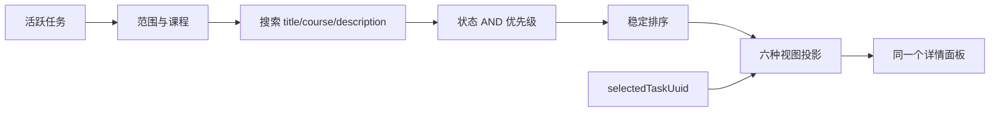

# Phase 4 多视图设计规格

- 状态：**Proposed / 可用于实现评审**
- 日期：2026-08-31
- 范围：Apple（iPadOS 与 Mac Catalyst）、Windows（WinUI 3）、Web
- 原型：[`prototypes/phase4-views/index.html`](../../prototypes/phase4-views/index.html)
- 数据：仅使用原型内生成的模拟数据；不连接 API、SQLite 或用户文件

## 1. 推荐方案

Phase 4 应把“查询”与“表达”分开：搜索、范围、筛选、排序和当前选择构成一个跨视图共享的 `ViewQueryState`；列表、日历、看板、表格、图库和 Cover Flow 是同一结果集的六种投影。切换视图不得重置查询，不得复制任务，也不得因某视图不展示某字段而修改该字段。

首发顺序建议为：

1. **列表**：默认视图。最高信息效率，延续当前客户端心智模型，也是键盘与辅助技术的可靠基线。
2. **日历**：回答“什么时候到期”，在学业任务场景中价值直接。必须保留“未安排”区。
3. **看板**：回答“进行到哪里”，适合推进状态和触控操作。
4. **表格**：面向专业模式、批量核对和高密度比较；需要成熟的虚拟化与列适配。
5. **图库**：在有附件或视觉交付物时有用；无附件时价值明显下降。
6. **3D Cover Flow**：适合作业成果回顾和演示，不是默认生产力视图。资源、运动与可访问性风险最高，应通过能力检测和设置开关逐步发布。

推荐发布门槛不是“六种一起上线”。列表先稳定共享查询状态，日历与看板复用后，再加入密集表格；图库和 Cover Flow 应分别由附件缩略图管线与 3D 性能证据解锁。

## 2. 设计目标

### 2.1 必须满足

- 六种视图读取同一份筛选、排序、搜索、范围和当前选择。
- 视图切换在 100 ms 内给出视觉响应；复杂内容可随后增量出现。
- 同一任务在所有视图中保持稳定身份，使用 `assignments.uuid`，不以标题或列表位置识别。
- 保留 v3 的状态、进度、完成时间、时区、全天和软删除语义。
- 鼠标、键盘、触控、屏幕阅读器和 Reduce Motion 均可完成主要流程。
- 10,000 条任务仍可搜索、筛选、选择和切换视图，且不一次创建 10,000 个视图节点。
- Apple、Windows、Web 共用行为合同，同时使用各平台原生布局和输入习惯。

### 2.2 本阶段不做

- 不接入真实数据库、Repository、API 或同步系统。
- 不修改 Apple、Windows 或 Web 生产客户端。
- 不设计任务编辑器、真实附件解码、缩略图后台任务或持久化用户偏好。
- 不实现跨设备同步、多人协作、在线状态、服务端查询或服务端排序。
- 不把 Cover Flow 设为默认视图，也不让自动播放成为任何交互的一部分。

## 3. 信息架构

宽屏采用四个稳定区域：

```text
┌────────范围/课程────────┬─────────────────共享标题与查询──────────────────┐
│ 全部 / 今天 / 本周      │ 列表 日历 看板 表格 图库 Cover Flow   [详情] │
│ 已逾期 / 已完成         ├───────────────────────────────────────────────┤
│                         │ 搜索    状态    优先级    排序    清除         │
│ 课程                    ├────────────────────────────┬──────────────────┤
│                         │ 当前视图                   │ 当前任务详情     │
└─────────────────────────┴────────────────────────────┴──────────────────┘
```

手机与窄 iPad 横向空间不足时，范围导航变成底部栏，视图切换只显示图标，详情成为全屏 sheet。看板和日历允许容器内横向滚动；页面本身不横向溢出。

## 4. 共享状态合同

```ts
type ViewQueryState = {
  scope: "all" | "today" | "week" | "overdue" | "completed";
  courseId: UUID | null;
  searchText: string;
  status: "all" | "todo" | "in_progress" | "done";
  priority: "all" | "low" | "medium" | "high";
  sort: "due" | "priority";
  view: "list" | "calendar" | "board" | "table" | "gallery" | "cover";
  selectedTaskUuid: UUID | null;
  inspectorVisible: boolean;
  displayMode: "simple" | "professional";
};
```

### 4.1 归属和生命周期

| 状态 | 归属 | 生命周期 | 切换视图 | 切换范围 |
| --- | --- | --- | --- | --- |
| `scope`、`courseId` | 工作区 | 当前窗口/场景 | 保留 | 用户触发时更新 |
| 搜索、状态、优先级、排序 | 工作区查询 | 当前窗口/场景 | 保留 | 保留 |
| `view` | 工作区 | 可持久化为平台偏好 | 更新 | 保留 |
| `selectedTaskUuid` | 工作区选择 | 当前窗口/场景 | 保留 | 保留，允许暂时不可见 |
| `inspectorVisible` | 展示状态 | 当前窗口/场景 | 保留 | 保留 |
| 视图滚动位置 | 各视图 | 当前窗口/场景 | 每个视图分别缓存 | 查询变化后重置或锚定选择 |

`selectedTaskUuid` 与查询结果独立。若筛选后当前任务不可见，详情仍可保持打开，结果栏显示“定位所选任务”；该操作清除冲突的查询并滚动至任务。系统不能默默改选结果中的第一项。若任务被真正软删除，才清空选择并把焦点移回结果区域。

### 4.2 共享查询流水线



搜索遵循现有合同：去除首尾空白后，对标题、课程和说明做不区分大小写的子串匹配。状态、课程、优先级使用逻辑 AND。截止日期升序时无日期任务放在最后；优先级排序为高、中、低，相同优先级再按截止日期。最终使用 `uuid` 做稳定 tie-breaker，防止虚拟列表在刷新时跳动。

范围必须保留既有时间规则：Today 与 Week 可包含已完成任务；Overdue 只包含截止时间早于当前时刻且未完成的任务；无截止日期的任务不属于 Today、Week 或 Overdue。

## 5. 字段展示矩阵

`P` 表示首要展示，`S` 表示次要或按空间展示，`D` 表示详情面板展示，`—` 表示视图本体不展示。

| 字段 | 列表 | 日历 | 看板 | 表格 | 图库 | Cover Flow |
| --- | --- | --- | --- | --- | --- | --- |
| 标题 | P | P（截断） | P | P | P | P（选中封面下） |
| 课程/课程色 | P | P（色条） | P | P | P | P |
| 截止日期/时间 | P | 位置 + S | P | P | P | P |
| 状态 | P | S | 列分组 | P | P | S |
| 优先级 | P | 紧凑标记 | P | P | S | D |
| 说明 | S，专业模式 | D | S，专业模式 | D/可选列 | D | D |
| 项目、标签 | D | D | D | 可选列 | D | D |
| 进度/子任务 | D | D | S | 可选列 | D | D |
| 全天、时区 | 截止字段语义 | 日期单元格/D | D | D | D | D |
| 附件 | D | D | D | 可选列 | P（缩略图） | P（封面纹理） |
| 来源/链接 | D | D | D | 可选列 | D | D |
| UUID/audit/软删除 | 调试详情 | — | — | 可选调试列 | — | — |

简洁模式只显示标题、课程、截止时间和状态。专业模式可增加说明、优先级与链接。模式是同一记录的投影，隐藏字段不能被写成空值。

### 5.1 各视图的职责

**列表**按时间分成“近期”和“稍后与未安排”，单行承担扫描与选择，不在行内堆叠所有操作。双击或 Enter 打开详情；完成操作放在详情或上下文菜单。

**日历**以月为默认粒度，单元格最多直接显示三项，余量使用“另有 N 项”。无日期任务固定放在月历下方的“未安排”区，不能因没有日期而丢失。全天任务属于本地日历日期，不转换成 UTC 午夜。

**看板**固定三列：未开始、进行中、已完成。任务状态是列归属的唯一来源。拖动是增强交互，必须同时提供上下文菜单、详情中的“推进状态”和键盘移动命令。进入完成列时原子更新 `status=done`、`progress_percent=100` 与 `completed_at`；移出完成列时清除 `completed_at` 并重新计算进度。

**表格**用于密集比较。标题、课程、截止、状态和优先级是默认列；项目、标签、进度、附件数量可从列菜单开启。表格支持列宽和列可见性偏好，但首发不建议自由拖动列顺序。第一列复选框改变完成状态，行选择仅改变当前选择，二者不能混淆。

**图库**展示真实缩略图时才有意义。无附件任务使用一致的文档占位图，不使用课程照片或不相关图库。缩略图只是一种表达，任务身份和选择仍来自 UUID。

**Cover Flow**只渲染当前项两侧有限数量的平面，使用提交预览作为纹理。点击、左右箭头、上一项/下一项按钮和水平轻扫都可切换。它不自动播放，不循环跳转，边界处按钮禁用。WebGL 不可用、GPU 受限或 Reduce Motion 策略要求时，使用静态 2D 封面轮播回退。

## 6. 选择与操作规则

1. 单击、单点或 Space 选择任务，更新所有视图共用的 `selectedTaskUuid`。
2. 双击或 Enter 打开同一个详情面板；手机上打开全屏 sheet。
3. 切换视图后，若所选任务在结果中，目标视图滚动/定位到它；若不在结果中，保持详情并提供显式恢复查询操作。
4. 视图内状态操作经过统一 command/repository 接口，更新成功后再更新各投影。原型只在内存中模拟该命令。
5. 写操作失败时保留选择、恢复原值、把焦点留在触发控件，并显示可读错误；不依赖颜色或短暂 toast 传达唯一信息。
6. Undo 面向最近一次可逆写操作。跨设备同步引入后，Undo 必须成为新写入而非抹除历史。

## 7. 键盘、触控与无障碍

### 7.1 全局键盘

| 操作 | 按键 |
| --- | --- |
| 聚焦搜索 | `/`（输入框外） |
| 在视图标签间移动并激活 | `←` / `→`，`Home` / `End` |
| 在页面可操作项间移动 | `Tab` / `Shift+Tab` |
| 选择当前任务 | `Space` |
| 打开当前任务详情 | `Enter` |
| 关闭详情、菜单或对话框 | `Esc` |
| Cover Flow 前后移动 | `←` / `→`；`Home` / `End` |

视图切换实现 ARIA Tabs：`tablist` 包含 `tab`，活动标签具有 `aria-selected=true` 并控制同一 `tabpanel`。因为六个投影来自本地内存且切换没有显著延迟，焦点移动可自动激活视图。Web 交互遵循 [W3C ARIA Tabs Pattern](https://www.w3.org/WAI/ARIA/apg/patterns/tabs/)。

### 7.2 各视图焦点模型

- 列表、图库和看板采用复合导航：生产实现建议容器单一 Tab stop + roving tabindex；原型保留每张卡可聚焦以便直接验证。
- 日历采用日期网格焦点；方向键移动日期，Enter 进入当日任务。首发可先使用原生列表化日历，避免不完整的 ARIA Grid。
- 表格使用语义表格。只有复选框、链接等真正可操作控件进入独立 Tab 顺序；行选择采用单一焦点模型。
- Cover Flow 是手动轮播，具有明确上一项/下一项按钮，不自动旋转。其区域命名、按钮顺序与静态回退遵循 [W3C Carousel Pattern](https://www.w3.org/WAI/ARIA/apg/patterns/carousel/)。

### 7.3 触控

- 所有主要目标至少 44 × 44 pt（Apple）或使用平台等效最小命中区域；视觉图标可小于命中框。
- 轻点选择，第二次轻点或详情按钮打开；不要把双击作为触控必需操作。
- 看板拖动需要长按起始、明显占位符、边缘自动滚动和触觉反馈；同一操作必须能通过按钮完成，以符合 [WCAG 2.2 拖动操作](https://www.w3.org/WAI/WCAG22/Understanding/dragging-movements.html)。
- Cover Flow 的水平轻扫阈值为 36 CSS px 左右，纵向意图优先交给页面滚动；上一项/下一项按钮始终可用。
- iPad 指针、Windows 精确触控板和 Web 鼠标支持 hover，但 hover 不承载唯一内容。

### 7.4 辅助技术

- 每个任务的可访问名称组合标题、状态与截止日期；课程色、状态点和优先级色都有文字等价物。
- 结果数量、筛选变化、Cover Flow 当前项变化使用礼貌 live region；连续滚动不反复播报。
- 标题长词可换行；200% 文字缩放时控制不得遮挡内容。
- 详情面板打开后，桌面保留上下文并可选择将焦点移到标题；手机 modal sheet 必须捕获焦点，关闭后把焦点还给原任务。
- 高对比度/强制颜色模式中使用系统色与边框，不能只靠阴影分层。

### 7.5 Reduce Motion

- Apple 读取 `accessibilityReduceMotion`，Windows 读取系统动画设置，Web 读取 `prefers-reduced-motion`。
- 开启后，视图切换、详情进入、看板重排和 Cover Flow 都即时完成或使用短淡化；不做位移、缩放、视差、弹簧或惯性连续动画。
- Cover Flow 保留空间结构，但卡片直接到目标位置。用户可再选择 2D 回退。
- 动画状态不能影响数据、焦点顺序或任务选择。Apple 建议自定义动画响应辅助功能设置；Web 对应 [MDN `prefers-reduced-motion`](https://developer.mozilla.org/en-US/docs/Web/CSS/Reference/At-rules/@media/prefers-reduced-motion)。

## 8. 大量任务性能策略

### 8.1 查询和状态

- 以任务 UUID 为主键维护内存索引；状态、课程、优先级使用集合索引，日期使用有序索引或预分桶。
- 搜索输入防抖 120–180 ms；10,000 条本地任务可在后台线程/actor 中过滤。查询结果发布前检查 generation token，丢弃过期结果。
- 对查询条件构造可比较的 query key。只在任务版本或 query key 变化时计算结果；视图切换复用结果数组。
- 排序使用稳定 tie-breaker `uuid`。只更新变化任务所属分桶，不因单项状态变化重新创建全部节点。

### 8.2 渲染预算

| 视图 | 策略 | 首屏预算 |
| --- | --- | --- |
| 列表 | 垂直虚拟化、预计行高 + 测量修正、上下 overscan 8–12 行 | DOM/原生节点约 40–80 |
| 日历 | 只构建可见月；按日期聚合；单日先显示 3 项 | 35–42 日格 + 可见任务 |
| 看板 | 每列独立虚拟化；拖动时冻结快照并只更新源/目标列 | 每列约 30–50 卡 |
| 表格 | 行虚拟化；列多时横向虚拟化；固定表头 | 50–100 行 |
| 图库 | 虚拟网格；缩略图按可见性懒加载；内存与磁盘 LRU | 约 30–60 卡 |
| Cover Flow | 只保留中心两侧 4 张可见 mesh；最大候选集 31，提供“更多”入口 | 9 mesh / 9 纹理 |

原型的 10,000 条模式用完整数组执行共享查询，但列表、表格、看板和图库只渲染窗口，状态栏明确显示窗口数量。生产实现不得把原型的固定窗口当作完整虚拟化方案。

### 8.3 附件与 GPU

- 缩略图是派生缓存，键为附件 SHA-256 + 尺寸 + scale factor；不得读取原图后长期保留全尺寸 bitmap。
- 生成 1x/2x 受控尺寸缩略图，解码放在后台。滚出 overscan 后取消低优先级任务。
- Cover Flow 使用压缩到显示上限的纹理，像素比上限建议 2；窗口不可见时停止渲染循环。
- 切出 3D 视图时释放纹理、材质、几何体和 renderer。Three.js 资源不会自动按普通 JavaScript 对象方式释放，生产实现必须调用 `dispose()`；参见 [Three.js Cleanup](https://threejs.org/manual/en/cleanup.html)。
- 连续动画采用按需帧循环，静止时不请求帧。检测 WebGL context loss，清理后回退 2D，不无限重建。

### 8.4 性能验收

在目标最低配置上用 10,000 个任务、1,000 个带缩略图任务测试：

- 输入到结果数量更新 P95 ≤ 150 ms；视图标签反馈 ≤ 100 ms。
- 滚动期间主线程单任务 P95 < 50 ms，不出现持续 1 秒以上卡死。
- 列表、表格常规滚动保持接近平台刷新率；3D 交互目标 60 fps，低端设备允许 30 fps 并自动降低像素比。
- 切出图库/Cover Flow 后，纹理和 bitmap 缓存回落到预算；连续切换 20 次无单调内存增长。
- 辅助技术开启、200% 文本、Reduce Motion 和高对比度下重复上述关键流程。

## 9. 平台差异

| 方面 | Apple | Windows | Web |
| --- | --- | --- | --- |
| 框架 | SwiftUI iPadOS + Mac Catalyst | WinUI 3 | 现有静态 Web 客户端的未来实现 |
| 主导航 | iPad `NavigationSplitView`；窄宽度折叠 | `NavigationView` 自动 pane | CSS 响应式侧栏/底栏 |
| 视图选择 | `Picker(.segmented)` 容量不足时 toolbar menu | CommandBar + TabView/segmented control | ARIA Tabs，可横向滚动 |
| 详情 | iPad 多列；紧凑宽度 sheet | 右侧 pane 或独立 ContentDialog | 宽屏 aside，窄屏 modal dialog |
| 列表/表格虚拟化 | `List`/Lazy 容器，实测 identity | `ListView`/`ItemsRepeater` | `content-visibility` 只能辅助，主方案用窗口化 |
| 看板拖动 | `draggable/dropDestination` + VoiceOver actions | WinUI drag/drop + UIA actions | Pointer Events + 按钮替代 |
| 菜单/右键 | 长按、context menu、Mac 右键 | 右键、MenuFlyout、键盘菜单键 | contextmenu + 显式更多按钮 |
| 快捷键显示 | Mac 菜单与 iPad 键盘 discoverability | KeyboardAccelerator / tooltip | tooltip 与快捷键帮助 |
| Reduce Motion | Environment accessibility value | 系统动画设置；不要只读自有偏好 | 媒体查询 + 可选应用覆盖 |
| 3D | Metal/SceneKit 或受控 WebGL；Catalyst 需单独测 | Win2D/Composition 或 WebView2 WebGL | Three.js WebGL + 2D 回退 |
| 高对比度 | Increase Contrast/不同外观 | Forced colors / High Contrast | `forced-colors` 媒体查询 |

三端共享状态合同、字段矩阵和验收夹具，不共享具体 UI 组件。Apple 与 Windows 应使用各自原生的集合、焦点、菜单和辅助技术 API；Web 原型只证明交互模型和布局，不应直接嵌入原生客户端。

Apple 无障碍实现应遵循 [Apple Accessibility HIG](https://developer.apple.com/design/human-interface-guidelines/accessibility)。Windows 需同时验证键盘、Narrator、缩放与高对比度，参考 [Microsoft Accessibility Overview](https://learn.microsoft.com/en-us/windows/apps/design/accessibility/accessibility-overview) 和 [Keyboard interactions](https://learn.microsoft.com/en-us/windows/apps/develop/input/keyboard-interactions)。

## 10. 实现边界

建议增加一个只读查询接口和一个写命令接口，而不是让六种 ViewModel 各自查询/写入：

```ts
interface TaskCollectionQuery {
  observe(query: TaskQuery): AsyncSequence<TaskSnapshot>;
  locate(taskUuid: UUID, query: TaskQuery): TaskLocation | null;
}

interface TaskCommandBus {
  setStatus(taskUuid: UUID, status: TaskStatus): Promise<Task>;
  setSubtaskCompletion(subtaskUuid: UUID, done: boolean): Promise<Task>;
}
```

`TaskSnapshot` 包含稳定排序后的 UUID 列表、按 UUID 索引的只读 Task projection、结果总数与 generation。每个视图只维护布局状态，例如滚动锚点、可见日期、列宽或 Cover Flow 中心索引。详情面板从同一 projection 读取。

不要建立 `CalendarTask`、`BoardTask`、`GalleryTask` 等可写副本。允许视图专用的只读 presentation model，但它们必须从 UUID + snapshot 派生，在 snapshot generation 变化时失效。

## 11. 空态、失败和能力回退

| 场景 | 行为 |
| --- | --- |
| 查询无结果 | 保留查询栏，说明无匹配并提供清除操作 |
| 当前选择被筛掉 | 保留详情，显示“定位所选任务” |
| 无截止日期 | 日历“未安排”区；其他视图按规则排序到后面 |
| 无附件 | 图库/3D 显示统一文档占位预览 |
| 缩略图失败 | 课程色 + 文档图标，保留文字标题 |
| WebGL 不可用/context lost | 同位置切到 2D 静态轮播，选择不变 |
| 写入失败 | 回滚单项投影、持久错误提示、焦点保留 |
| 任务从其他来源变化 | 按 UUID 更新；若当前项删除，移动到逻辑邻项并播报 |
| 10,000+ 结果 | 窗口化渲染，结果总数仍显示完整值 |

## 12. 原型说明

原型包含：

- 24 条结构化模拟任务和 10,000 条压力模式。
- 六个可切换视图与共享搜索、筛选、排序、范围和选择。
- 同一个详情面板中的状态、子任务与完成操作；改动仅存在浏览器内存。
- 可撤销最近一次模拟变更。
- 键盘视图切换、任务选择、详情打开和 Cover Flow 导航。
- 触控轻扫 Cover Flow。
- 系统 Reduce Motion 与原型内强制开关。
- Three.js 3D 封面、按需渲染、资源释放和静态回退。
- 本地 Canvas 生成的模拟附件封面，不包含外部图片或真实用户资料。

运行方式：

```powershell
cd D:\Desktop\assignment-app-phase4-views\prototypes\phase4-views
& "C:\Users\wangz\.cache\codex-runtimes\codex-primary-runtime\dependencies\node\bin\node.exe" server.cjs
```

打开 `http://127.0.0.1:4174`。服务器只监听 loopback，并通过 CSP 禁止原型连接外部服务。

截图位于 `prototypes/phase4-views/screenshots/`：

- `01-list-desktop.png`：默认列表与共享查询。
- `02-calendar-desktop.png`：月历与未安排区。
- `03-board-desktop.png`：三状态看板。
- `04-table-desktop.png`：密集表格。
- `05-gallery-desktop.png`：模拟提交缩略图。
- `06-cover-flow-desktop.png`：Three.js 3D Cover Flow。
- `07-list-mobile.png`：手机响应式布局。
- `08-cover-reduced-motion.png`：Reduce Motion 下的 Cover Flow。

## 13. 验收清单

- [ ] 在任一视图设置搜索、状态、优先级与排序，逐一切换六种视图，条件不变化。
- [ ] 选中一项后逐一切换六种视图，同一 UUID 仍为当前任务。
- [ ] 筛掉当前任务时详情不丢失，定位操作能恢复查询并定位。
- [ ] 无截止日期任务在日历“未安排”区可见。
- [ ] 完成任务同步更新状态、完成时间、进度与子任务；恢复时清除完成时间。
- [ ] 视图标签、任务、对话框、详情和 Cover Flow 可仅用键盘操作。
- [ ] 拖动之外存在等价状态改变操作。
- [ ] 系统 Reduce Motion 和手动开关均停止空间位移动画。
- [ ] 320 px 宽与 200% 文字下无内容遮挡；长连续标题可完整访问。
- [ ] 10,000 条模式不一次构建 10,000 个任务节点。
- [ ] WebGL 不可用时 2D 回退仍可选择和打开任务。
- [ ] Apple/Windows/Web 使用同一共享行为夹具验证筛选、排序和时间边界。

## 14. 风险与开放问题

1. Phase 4 是否包含真正的附件缩略图管线？若不包含，图库和 Cover Flow 应继续保持实验性入口。
2. 表格是否需要多选和批量操作？这会显著增加焦点、Undo 与移动端设计复杂度。
3. 看板是否允许自定义列？当前领域状态只有三个固定值；首发建议固定列。
4. 日期是否需要周视图与日视图？月视图可覆盖首发，更多粒度应由真实使用数据决定。
5. `ViewQueryState` 的哪些字段应跨启动持久化？建议只持久化 `view`、`displayMode` 和表格列偏好，避免用户再次打开时困在旧筛选中。
6. Cover Flow 在 Apple 原生端采用 SceneKit/Metal，还是复用 WebGL？应在目标设备用启动耗时、内存、VoiceOver 和 Reduce Motion 证据决定。

## 15. 决策记录

首发采用“列表 → 日历 → 看板 → 表格”的生产路线；图库和 Cover Flow 标记为附件驱动的增强视图。六种视图从第一步就共享单一查询与选择模型，即使后两种尚未向所有用户开放，也不得建立平行状态体系。

这个顺序让高频工作先获得稳定、可访问且高性能的基础，同时保留项目已有 Cover Flow 的视觉辨识度。3D 仍然是产品性格的一部分，但其入口和资源预算受用户任务、设备能力与辅助功能偏好约束。
